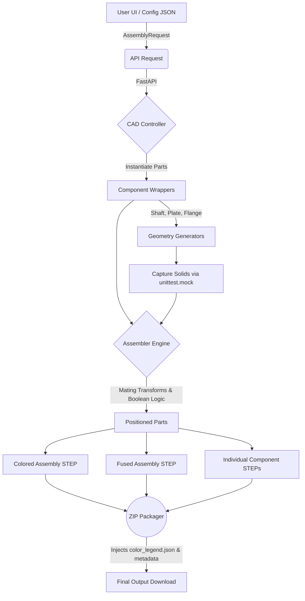

# CAD Automation System v1.3.1

Parametric CAD generation web application powered by a beautiful React frontend and a robust FastAPI backend.

## 🛠️ What's Fixed in v1.3.1?
- **Global Coordinate Alignment**: Fixed critical geometry mismatches across all 6 CAD components (`Shaft`, `Flange`, `Plate`, `L-Bracket`, `U-Bracket`, `Housing`). Component connector vectors now perfectly mirror CadQuery's extrusion directions (originating from `Z=0`), eliminating overlapping parts and ensuring `gap=0.000000mm` in multi-part assemblies.
- **U-Bracket Mathematical Sync**: Fixed a broken reference where `UBracketComponent` awaited a `thickness` parameter from the frontend that didn't exist. It now properly derives thickness via the generator's formula (`thickness = 0.1 * width`), restoring vertical connector positioning.
- **Flange Refactoring Completion**: Completed the transition of `Flange` connectors to `back_center` and `front_center` in the backend wrapper, aligning it with the frontend's smart dropdown UI.

## 🚀 What's New in v1.3?
- **Precision Geometric Connectors**: Connector points are now directly derived from the CAD component's mathematical parameters, eliminating hardcoded positions and ensuring exact physical mating.
- **Robust Assembly Math Transformations**: The `assembler.py` core was completely refactored to use standard Rodrigues rotation matrices, ensuring parts align correctly without unexpected offsets.
- **Dynamic Connector Chaining**: As parts are moved and bolted into an assembly, their respective connectors are dynamically translated into global world-space coordinates, enabling deep, multi-part connection chaining.
- **Zero-Gap Precision Logging**: A new automatic logging system calculates the geometric distance between connected points, verifying that all mating faces have exactly 0.000000mm gaps. Logs are exported in the ZIP bundle.
- **Dynamic Assembly Engine**: Complex multi-part assemblies can now be generated automatically by linking mathematical connector points. The `assembler.py` core handles 3D spatial transformations and chained geometric positioning.
- **Physical Color System**: Every generated component type now features a physical, realistic CAD color (e.g., Brass Orange, Steel Blue) defined centrally in `color_registry.py`. The backend automatically packages a `color_legend.json`.
- **Triple-Output CAD Export**: The pipeline now generates three distinct forms of CAD data per request:
  1. `assembly_colored.step`: A true multi-body CAD assembly preserving individual parts and their assigned colors.
  2. `assembly_fused.step`: A boolean union (single solid) of the entire assembly, perfect for downstream CNC machining or 3D printing.
  3. `part_*.step`: Isolated `.step` files for every individual component.
- **Smart Connection Builder**: The frontend UI now features a dynamic cascading dropdown system. When you select a connector on a component, the target dropdown automatically filters itself based on strict mechanical mating rules (e.g. `cylindrical` connectors can only mate with `face` or `hole` types), preventing impossible assembly configurations.
- **Component-Based Architecture**: Core geometries (`shaft`, `flange`, `plate`, `brackets`, `housing`) have been modularized into standard `BaseComponent` wrappers.
- **Advanced ZIP Packaging**: Overhauled export system bundles all STEP files, `params.json`, `metadata.json`, and `logs.txt` into a robust `output.zip` directory designed for seamless cross-platform extraction.

## 📊 System Architecture Flow



## 🧩 Connector Reference Guide

When building an assembly, you must connect valid geometric points together. The system uses a strict string-based naming convention (e.g., `part_id.connector_name`).

| Component Type | Valid Connection Names | Description / Location |
| :--- | :--- | :--- |
| **Shaft** | `left_end` <br> `right_end` | The circular flat face on the left side (origin).<br>The circular flat face on the right side. |
| **Flange** | `back_center` <br> `front_center` <br> `bolt_holes` | The flat back face of the flange.<br>The flat front face of the flange.<br>The circular array of bolt holes. |
| **Plate** | `top_face` <br> `bottom_face` | The main upper surface.<br>The main lower surface. |
| **Housing** | `top_face`<br>`bottom_face`<br>`front_face` | The upper horizontal face.<br>The lower horizontal base.<br>The front vertical face. |
| **L-Bracket** | `face_1`<br>`face_2` | The horizontal base face.<br>The upright vertical wall face. |
| **U-Bracket** | `base_face`<br>`left_wall`<br>`right_wall` | The bottom flat base.<br>The inner/outer face of the left wall.<br>The inner/outer face of the right wall. |

**Example Mating Connection:**
To attach a Shaft (ID: `1`) to the back of a Flange (ID: `2`):
`1.right_end`  ↔  `2.back_center`

---

## ⚙️ Parameter Validation Rules

To prevent physically impossible or unstable CAD models, both the Frontend and Backend enforce strict synchronous mathematical rules using Pydantic `@model_validator`. Furthermore, the **Mating Rules** ensure that connection combinations are valid:
- `Cylindrical` connectors can mate with `Cylindrical`, `Hole`, and `Face`.
- `Face` connectors can mate with `Face`, `Hole`, and `Cylindrical`.
- `Hole` connectors can mate with `Cylindrical` and `Face`.

### 1. Shaft
- **Diameter**: `6mm` to `500mm`
- **Length**: `10mm` to `2000mm`
- **Rule**: Length cannot exceed 20× its Diameter.

### 2. Plate
- **Length/Width**: `10mm` to `2000mm`
- **Rule**: Aspect ratio (Length / Width) must be 4:1 or less.

### 3. Flange
- **Inner Diameter**: `36mm` to `620mm`

### 4. L-Bracket
- **Length 1 (L1) / Length 2 (L2)**: `10mm` to `1000mm`
- **Width (W)**: `10mm` to `500mm`
- **Rule**: Both L1 and L2 must be ≥ Width.

### 5. U-Bracket
- **Length (L) / Height (H)**: `10mm` to `1000mm`
- **Width (W)**: `10mm` to `500mm`
- **Rule**: Base Length and Height must be ≥ Width.

### 6. Housing
- **Dimensions (L, W, H)**: `20mm` to `2000mm`
- **Rule**: Derived wall thickness cannot consume more than 40% of the internal cavity space.

---

## 📡 API Reference

All successful CAD generation endpoints return a ZIP file bundle containing:
- `assembly_colored.step`
- `assembly_fused.step`
- `part_{id}.step` (Individual files for every piece)
- `params.json`
- `metadata.json`
- `logs.txt`
- `color_legend.json`

### `POST /api/assembly/generate`
The primary endpoint for dynamic assembly configuration.

**Request Example (`example_assembly_input.json`):**
```json
{
  "assembly_name": "Drive_Assembly",
  "parts": [
    { "id": "1", "type": "shaft", "parameters": { "diameter": 20, "length": 100 } },
    { "id": "2", "type": "flange", "parameters": { "inner_diameter": 40 } },
    { "id": "3", "type": "shaft", "parameters": { "diameter": 20, "length": 80 } }
  ],
  "connections": [
    ["1.right_end", "2.back_center"],
    ["2.front_center", "3.left_end"]
  ],
  "export_modes": ["assembly"]
}
```

### `POST /api/{model}/generate`
Legacy endpoints for single-part generation (e.g. `/api/shaft/generate`, `/api/flange/generate`).

**Success Response:**
```json
{
  "success": true,
  "message": "Assembly generated successfully",
  "fileUrl": "/api/download/assembly-output-<id>.zip",
  "downloadName": "assembly-output.zip",
  "outputFiles": [
    "assembly_colored.step",
    "assembly_fused.step",
    "part_1.step",
    "part_2.step",
    "part_3.step",
    "params.json",
    "metadata.json",
    "logs.txt",
    "color_legend.json"
  ]
}
```

**Validation Error Response (HTTP 422 Unprocessable Entity):**
```json
{
  "detail": [
    {
      "loc": ["body", "parts", 0, "length"],
      "msg": "Geometry Failure: Length cannot exceed 20x its diameter.",
      "type": "value_error"
    }
  ]
}
```

### `GET /api/download/{filename}`
Downloads the packaged ZIP output.

---

## 📁 Project Structure

```
cen/
├── backend/
│   ├── assembly/                  # Chained geometric positioning and transformations
│   ├── cad/                       # Base generation scripts (CadQuery logic)
│   ├── components/                # Modular OOP wrappers inheriting from BaseComponent
│   ├── config/                    # Factories and central config settings
│   ├── configs/                   # Assembly JSON configuration templates
│   ├── controllers/               # FastAPI route definitions
│   ├── schemas/                   # Strict Pydantic validation boundaries
│   ├── services/                  # Business logic (e.g. ZIP packaging)
│   ├── main.py                    # Server Entrypoint
│   └── pipeline.py                # CAD Pipeline Orchestrator
├── frontend/
│   ├── src/
│   │   ├── components/            # React Components (AssemblyBuilder, ParameterForm)
│   │   ├── services/              # API and error standardizer
│   │   ├── styles/                # UI Glassmorphism CSS
│   │   └── App.tsx                # Client Routing and State
│   └── package.json
└── README.md
```

## 💻 Run Locally

### Automatic Script
```bash
# On Windows, simply double-click or run:
.\run_project.bat
```

### Manual Start - Backend (FastAPI)
```bash
cd backend
pip install -r requirements.txt
uvicorn main:app --host 0.0.0.0 --port 8000 --reload
```

### Manual Start - Frontend (React/Vite)
```bash
cd frontend
npm install
npm run dev
```
Open your browser and navigate to `http://localhost:5173`.